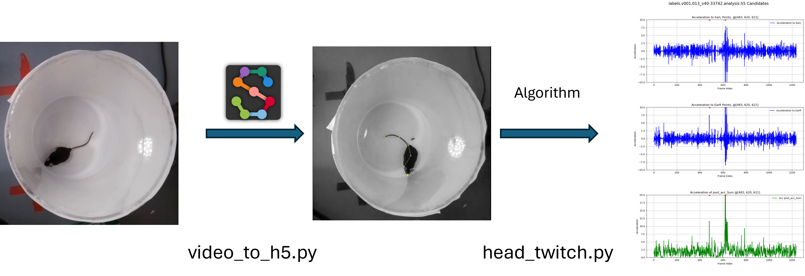

# Head_twitch

1. Run the video_to_h5.py
  1.1. change the path based on your local setting
3. Open Conda terminal and Activate conda sleap
4. Run track_list_1.bat in Conda terminal
5. Run convert_list_1.bat in Conda terminal
